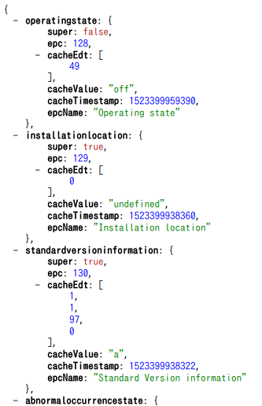

**node-picogw-plugin-echonet** is a mandatory plugin module for [PicoGW](https://github.com/KAIT-HEMS/node-picogw), a [Home Automation](https://en.wikipedia.org/wiki/Home_automation) and [Building Automation](https://en.wikipedia.org/wiki/Building_automation) devices gateway server, developed by [Kanagawa Institute of Technology, Smart House Research Center](http://sh-center.org/en/), released under [MIT license](https://opensource.org/licenses/mit-license.php).
This is automatically installed when you install PicoGW.

## ECHONET Lite plugin APIs

### GET /v1/echonet
This path is the ECHONET Lite plugin root.
The API call returns ECHONET Lite devices ID (internally generated unique ID) with their MAC address and current IP address.

#### GET /v1/echonet/[DeviceID]
ECHONET Lite device object.
[DeviceID] is the unique name of ECHONET Lite device. This call returns ECHONET Lite device's Property IDs (EPC) and its cached value (if exists), and whether the property only exists in the super class (see ECHONET Lite specification). Example call result is :

#### GET /v1/echonet/[DeviceID]/[PropertyID]

GET access to the ECHONET Lite property.
This API will send GET request to a ECHONET Lite device and wait until the result is obtained. The API will return error if preset timeout time has past (30 seconds)
If a vaild value is obtained, the value is stored in the device's cache.

#### PUT /v1/echonet/[DeviceID]/[PropertyID]
This will set a new value (EDT) to the property. Thew new value is specified in the body text as a JSON object:

>{"value":NEWVAL}

You can also specify the ECHONET Lite binary array directly.

>{"edt":[48]}

This request header must contain "Content-type: application/json".  

There are several kinds of NEWVALs specify-able, depending on the definition. For example, operatingstate accepts the string "**on**" or "**off**", while air-conditioner's TemperatureSetValue accepts the temperature value as a number directly. The complete list of available values is in v1/plugins/echonet/proc_converter.js (See also all_Body.json to correspond ECHONET ID number to PicoGW name.)  

**edt** field only accepts the array of decimal digit such as **[48]**.

#### GET /v1/echonet/[REGEXP]/[PropertyID]

ECHONET Lite plugin supports regular expression for device names. For example:

> PUT http://192.168.1.10:8080/v1/echonet/.+/operatingstate/

with the body text as {"value":"on"} will set 0x30 to all existing devices's operatingstate.

> GET http://192.168.1.10:8080/v1/echonet/(genericillumination_1|airconditioner_1)/operatingstate/

will obtain operatingstate of a light and an airconditioner at once. Note that the response time is dominated by the slowest device.

PropertyID cannot accept regular expression (because it can easily be many!)

#### DELETE /v1/echonet

Clear all device cache information and reset device ID counter.

#### DELETE /v1/echonet/[DeviceID]

Clear one device cache information without resetting the device in ID counter. Therefore, if a real device remain exist, it appears again with different device ID.

#### DELETE /v1/echonet/[DeviceID]/[PropertyID]

Clear one property cache and tries to get a new one.

### PubSub

This plugin publishes a property value at device notification. Also publishes when a property cache value is changed.